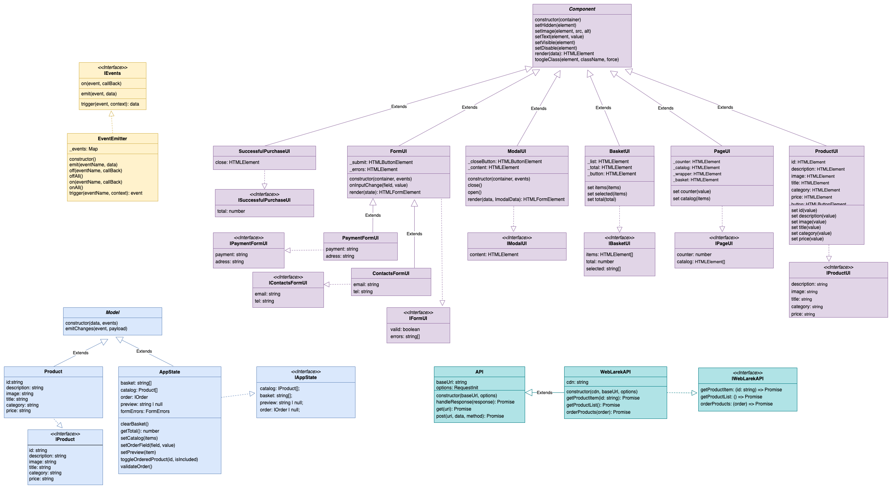

# Проектная работа "Веб-ларек"

Стек: HTML, SCSS, TS, Webpack

Структура проекта:
- src/ — исходные файлы проекта
- src/components/ — папка с JS компонентами
- src/components/base/ — папка с базовым кодом

Важные файлы:
- src/pages/index.html — HTML-файл главной страницы
- src/types/index.ts — файл с типами
- src/index.ts — точка входа приложения
- src/styles/styles.scss — корневой файл стилей
- src/utils/constants.ts — файл с константами
- src/utils/utils.ts — файл с утилитами

## Установка и запуск
Для установки и запуска проекта необходимо выполнить команды

```
npm install
npm run start
```

или

```
yarn
yarn start
```
## Сборка

```
npm run build
```

или

```
yarn build
```


## Описание проекта 
Проект является интернет-магазином и представляет собой веб-приложение, разработанное с использованием паттерна проектирования MVP (Model-View-Presenter). Он позволяет пользователям просматривать каталог товаров, добавлять их в корзину, оформлять заказы и просматривать дополнительную информацию о товарах.

Взаимодействие между классами происходит через событийную модель и прямые вызовы методов, позволяя каждому классу эффективно выполнять свою функцию и реагировать на изменения в приложении.

## Архитектура


## Базовые классы
### Api:
Класс Api предоставляет базовые методы для взаимодействия с серверным API. Класс Api предоставляет интерфейс для взаимодействия с сервером посредством выполнения HTTP-запросов.

`constructor(baseUrl: string, options: RequestInit = {})` - cоздает новый экземпляр класса Api с указанным базовым URL и опциями запроса.

Методы:
  - `get` - выполняет HTTP GET запрос по указанному URI и возвращает объект с данными ответа.
  - `post` - выполняет HTTP POST запрос по указанному URI с переданными данными и методом запроса (по умолчанию 'POST') и возвращает объект с данными ответа.

### Component<T>:
Абстрактный базовый класс, предназначенным для создания компонентов пользовательского интерфейса. Класс обеспечивает инструментарий для управления DOM элементами и поведением компонента. Наследуется всеми классами представления(View)

`constructor(container: HTMLElement)` - принимает элемент контейнера, в который будет помещен компонент.

Методы:
  - `toggleClass` - переключает класс для переданного элемента.
  - `setText` - устанавливает текстовое содержимое для переданного элемента.
  - `setImage` - устанавливает изображения и альтернативный текст для изоображения для переданного элемента типа HTMLImageElement
  - `setDisabled` - изменяет статус блокировки для переданного элемента.
  - `setHidden` - скрывает переданный элемент.
  - `setVisible` - отоброжает переданный элемент.
  - `render` - рендерит компонент, используя переданные данные. Метод должен быть переназначен в дочерних классах.

### EventEmitter:
Класс EventEmitter реализует механизм событий для обмена данными и сообщениями между компонентами приложения.
Он позволяет устанавливать обработчики событий, эмитировать события и слушать все события или события по определенным именам.

- `constructor()` - cоздает новый экземпляр класса EventEmitter.

Методы:
  - `on` - устанавливает обработчик для события.
  - `off` - удаляет обработчик для события.
  - `emit` - инициирует событие с переданными данными.
  - `onAll` - устанавливает обработчик для всех событий.
  - `offAll` - удаляет все обработчики событий.
  - `trigger` - создает триггер, который генерирует событие при вызове.

Реализует паттерн «Наблюдатель» и позволяет подписываться на события и уведомлять подписчиков о наступлении события.
Интересным дополнением является метод  trigger , генерирующий заданное событие с заданными аргументами. Это позволяет передавать его в качестве обработчика события в другие классы. Эти классы будут генерировать события, не будучи при этом напрямую зависимыми от класса  EventEmitter.

### Model<T>:
Абстрактный класс Model представляет модели данных, которые используются для представления состояния приложения. Наследуется классами данных (Model)

- `constructor(data: Partial<T>, events: IEvents)` - cоздает новый экземпляр класса Model с переданными данными и объектом для управления событиями.

Методы:
  - `emitChanges` - cообщает всем заинтересованным сторонам о изменениях в модели.

## Слой работы с данными (Model)
### Product:
Класс Product представляет конкретный продукт в магазине. Он реализует интерфейс IProduct и вызывает конструктор базового класса Model, чтобы унаследовать его функциональность. Конструктор класса позволяет создавать новые экземпляры продукта с заданными параметрами.

Поля:
- `id: string` - Уникальный идентификатор продукта.
- `description: string` - Описание продукта.
- `image: string` - Ссылка на изображение продукта.
- `title: string` - Наименование продукта.
- `category: string` - Категория, к которой относится продукт.
- `price: string` - Цена продукта.

### AppState:
Класс AppState представляет глобальное состояние приложения. Интерфейс IAppState определяет структуру глобального состояния приложения. Класс AppState наследуется от Model<IAppState>, что позволяет использовать функциональность базовой модели для управления событиями и обновлением данных.

Поля:
- `basket: string[]` - Массив идентификаторов товаров в корзине.
- `catalog: Product[]` - Массив объектов товаров в каталоге.
- `loading: boolean` - Флаг, указывающий на состояние загрузки данных.
- `order: IOrder`- Объект, представляющий заказ пользователя.
- `preview: string | null` - Идентификатор предпросматриваемого товара или null, если предпросмотр отключен.
- `formErrors: FormErrors` - Объект, содержащий ошибки формы заказа.

Методы:
- `toggleOrderedProduct` - Метод для добавления или удаления товара из заказа.
- `clearBasket` - Метод для очистки корзины и заказа.
- `getTotal` - Метод для вычисления общей стоимости товаров в заказе.
- `setCatalog` - Метод для установки каталога товаров и отправки соответствующего события об изменении.
- `setPreview` - Метод для установки предпросматриваемого товара и отправки соответствующего события об изменении.
- `setOrderField` - Метод для установки значения поля заказа и проверки наличия достаточных данных для оформления заказа.
- `validateOrder` - Метод для валидации данных заказа и отправки соответствующего события об изменении ошибок формы.

## Слой отображения (View)
В этой главе мы рассмотрим слой View нашего приложения, который отвечает за отображение пользовательского интерфейса и взаимодействие с пользователем.
### SuccessfulPurchaseUI:
Назначение: Этот класс отвечает за отображение интерфейса успешной покупки.
Наследуется от: Component<ISuccessfulPurchaseUI>
Интерфейс: ISuccessfulPurchaseUI

Поля:
- `_close: HTMLElement` - Элемент для закрытия сообщения.

`constructor(container: HTMLElement, actions: ISuccessActions)` - Принимает элемент контейнера и действия, которые могут быть выполнены при успешном завершении операции.

Класс SuccessfulPurchaseUI наследуется от Component<ISuccessfulPurchaseUI>, что позволяет использовать его как компонент пользовательского интерфейса и предоставляет инструменты для работы с DOM элементами.

### FormUI:
Назначение: Класс FormUI управляет отображением и взаимодействием с формами.
Наследуется от: Component<IFormUI>
Интерфейс: IFormUI
Описание: FormUI предоставляет общие методы для управления формами, такие как установка значений полей и валидация.

Поля:
- `_submit: HTMLButtonElement` - Кнопка отправки формы.
- `_errors: HTMLElement` - Элемент для отображения ошибок формы.

`constructor(container: HTMLFormElement, events: IEvents)` - Принимает элемент формы и объект для управления событиями. Вызывает конструктор родительского класса Component, чтобы инициализировать базовый функционал компонента. Инициализирует элементы формы и устанавливает обработчики событий для ввода данных и отправки формы.

Методы:
- `onInputChange` - Отправляет событие об изменении данных ввода.
- `set valid` - Устанавливает состояние доступности кнопки отправки в зависимости от валидности формы.
- `set errors` - Устанавливает текст ошибок формы.
- `render` - Рендерит компонент формы с учетом переданного состояния.

#### PaymentFormUI:
Наследуется от: FormUI
Описание: PaymentFormUI специализируется на обработке информации платежей.

`constructor(container: HTMLFormElement, events: IEvents)` - Принимает элемент формы и объект для управления событиями. Вызывает конструктор родительского класса Form<IPaymentFormUI>, чтобы инициализировать базовый функционал компонента.

Методы:
- `set payment` - Устанавливает способ оплаты в форме оплаты.
- `set address` - Устанавливает адрес доставки в форме оплаты.

#### ContactsFormUI:
Наследуется от: FormUI
Описание: ContactsFormUI специализируется на сборе контактной информации пользователей.

`constructor(container: HTMLFormElement, events: IEvents)` - Принимает элемент формы и объект для управления событиями. Вызывает конструктор родительского класса Form<IContactsFormUI>, чтобы инициализировать базовый функционал компонента.

Методы:
- `set email` - Устанавливает email в форме контактов.
- `set tel` - Устанавливает телефон в форме контактов.

### ModalUI:
Назначение: ModalUI отвечает за создание и управление модальными окнами.
Наследуется от: Component<IModalUI>
Интерфейс: IModalUI
Описание: Класс ModalUI предоставляет методы для открытия, закрытия и управления содержимым модальных окон.

Поля:
- `_closeButton: HTMLButtonElement` - Кнопка для закрытия модального окна.
- `_content: HTMLElement` - Элемент контента модального окна.

`constructor(container: HTMLElement, events: IEvents)` - Принимает элемент контейнера и объект для управления событиями. Вызывает конструктор родительского класса Component<IModalUI>, чтобы инициализировать базовый функционал компонента. Инициализирует элементы модального окна и устанавливает обработчики событий для кнопки закрытия, контейнера модального окна и контента.

Методы:
- `open` - Открывает модальное окно и отправляет соответствующее событие.
- `close` - Закрывает модальное окно, очищает контент и отправляет соответствующее событие.
- `render` - Рендерит компонент модального окна с учетом переданных данных и открывает его.

### BasketUI:
Назначение: BasketUI управляет отображением информации о корзине покупок.
Наследуется от: Component<IBasketUI>
Интерфейс: IBasketUI
Описание: BasketUI отображает содержимое корзины покупок, а также предоставляет методы для управления элементами в корзине.

Поля:
- `_list: HTMLElement` - Элемент списка товаров в корзине.
- `_total: HTMLElement` - Элемент для отображения общей стоимости товаров в корзине.
- `_button: HTMLElement` - Кнопка для оформления заказа.

`constructor(container: HTMLElement, events: EventEmitter)` - Принимает элемент контейнера и объект для управления событиями. Вызывает конструктор родительского класса Component<IBasketUI>, чтобы инициализировать базовый функционал компонента. Инициализирует элементы корзины и устанавливает обработчик события для кнопки оформления заказа.

Методы:
- `set items` - Устанавливает список элементов товаров в корзине.
- `set selected` - Устанавливает список выбранных товаров в корзине и включает или отключает кнопку оформления заказа в зависимости от наличия выбранных товаров.
- `set total` - Устанавливает общую стоимость товаров в корзине.

### PageUI:
Назначение: PageUI управляет отображением основной страницы приложения.
Наследуется от: Component<IPageUI>
Интерфейс: IPageUI
Описание: PageUI отображает содержимое главной страницы приложения, такое как каталог продуктов и счетчик элементов.

Поля:
- `_counter: HTMLElement` - Элемент счетчика товаров в корзине.
- `_catalog: HTMLElement` - Элемент каталога товаров.
- `_wrapper: HTMLElement` - Элемент-обертка страницы.
- `_basket: HTMLElement` - Элемент корзины.

`constructor(container: HTMLElement, events: IEvents)` - Принимает элемент контейнера и объект для управления событиями. Вызывает конструктор родительского класса Component<IPageUI>, чтобы инициализировать базовый функционал компонента. Инициализирует элементы страницы, включая счетчик товаров в корзине, каталог товаров и корзину. Устанавливает обработчик события для клика по корзине, чтобы открыть корзину товаров.

Методы:
- `set counter` - Устанавливает значение счетчика товаров в корзине.
- `set catalog` - Устанавливает список элементов каталога товаров на странице.

### ProductUI:
Назначение: ProductUI отображает информацию о продукте.
Наследуется от: Component<IProductUI>
Интерфейс: IProductUI
Описание: ProductUI отображает информацию о конкретном продукте, такую как его название, изображение, описание и цена.

Поля:
- `_title: HTMLElement` - Элемент заголовка продукта.
- `_image: HTMLImageElement` - Элемент изображения продукта.
- `_description: HTMLElement` - Элемент описания продукта.
- `_category: HTMLElement` - Элемент категории продукта.
- `_price: HTMLElement` - Элемент цены продукта.
- `_button: HTMLButtonElement` - Кнопка действия для продукта.

`constructor(blockName: string, container: HTMLElement, actions?: IProductUIActions)` - Принимает имя блока, элемент контейнера и объект для управления действиями. Вызывает конструктор родительского класса Component<IProductUI<T>>, чтобы инициализировать базовый функционал компонента. Инициализирует элементы продукта и устанавливает обработчики событий для кнопки действия, если они предоставлены.

Методы:
- `set id` - Получает и устанавливает идентификатор продукта.
- `set title` - Получает и устанавливает заголовок продукта.
- `set image` - Получает и устанавливает изображение продукта.
- `set description` - Получает и устанавливает описание продукта.
- `set category` - Получает и устанавливает категорию продукта.
- `set price` - Получает и устанавливает цену продукта.

##  Типы данных
```
// Интерфейс, описывающий структуру продукта
export interface IProduct {
  id: string;
  description?: string;
  image?: string;
  title: string;
  category?: string;
  price: string;
}

// Интерфейс, описывающий глобальное состояние приложения
export interface IAppState {
  catalog: IProduct[];
  basket: string[];
  preview: string | null;
  order: IOrder | null;
}

// Интерфейс для UI формы оплаты
export interface IPaymentFormUI {
  payment: string;
  address: string;
}

// Интерфейс для UI формы контактов
export interface IContactsFormUI {
  email: string;
  tel: string;
}

// Интерфейс для данных о заказе
export interface IOrder extends IPaymentFormUI, IContactsFormUI {
  items: string[]
}

// Интерфейс для UI успешной покупки
export interface ISuccessfulPurchaseUI {
  total: number;
}

// Интерфейс для UI модального окна
export interface IModalUI {
  content: HTMLElement;
}

// Интерфейс для UI корзины покупок
export interface IBasketUI {
  items: HTMLElement[];
  total: number;
  selected: string[];
}

// Интерфейс для UI главной страницы
export interface IPageUI {
  counter: number;
  catalog: HTMLElement[];
}

// Интерфейс для UI отображения продукта
export interface IProductUI {
  id: string;
  description?: string;
  image?: string;
  title: string;
  category?: string;
  price: string;
}
```


Вот список вопросов, которые по заданию должна раскрывать документация:
Из каких основных частей состоит архитектура проекта? Это могут быть данные, отображения, экраны и так далее.
Зачем нужны эти части, какие функции они выполняют?
Как части взаимодействуют?
Какие данные используются в приложении? Можете записать конкретные типы данных или интерфейсов, пояснив их функции.
Из каких компонентов состоит приложение?
Как реализованы процессы в приложении? Через события или как-то иначе, например: с помощью единого контроллера или promise-based flow, как в готовом кейсе в предыдущем спринте.
Проверьте, что на все вопросы ответили в документации