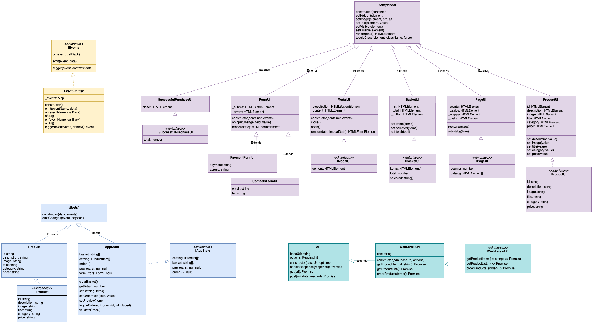

# Проектная работа "Веб-ларек"

Стек: HTML, SCSS, TS, Webpack

Структура проекта:
- src/ — исходные файлы проекта
- src/components/ — папка с JS компонентами
- src/components/base/ — папка с базовым кодом

Важные файлы:
- src/pages/index.html — HTML-файл главной страницы
- src/types/index.ts — файл с типами
- src/index.ts — точка входа приложения
- src/styles/styles.scss — корневой файл стилей
- src/utils/constants.ts — файл с константами
- src/utils/utils.ts — файл с утилитами

## Установка и запуск
Для установки и запуска проекта необходимо выполнить команды

```
npm install
npm run start
```

или

```
yarn
yarn start
```
## Сборка

```
npm run build
```

или

```
yarn build
```


## Описание проекта 
Проект является интернет-магазином и представляет собой веб-приложение, разработанное с использованием паттерна проектирования MVP (Model-View-Presenter). Он позволяет пользователям просматривать каталог товаров, добавлять их в корзину, оформлять заказы и просматривать дополнительную информацию о товарах.

## Архитектура


## Базовые классы
### Api:
Класс Api предоставляет интерфейс для взаимодействия с сервером посредством выполнения HTTP-запросов.
Он содержит методы get() и post(), которые выполняют GET и POST запросы соответственно.
Конструктор класса принимает базовый URL сервера и опции для настройки запросов (например, заголовки).

### Component<T>:
Абстрактный класс Component представляет компоненты интерфейса пользователя и обеспечивает базовую функциональность для работы с DOM элементами.
Он содержит методы для управления видимостью, содержимым и состоянием DOM элементов, а также для рендеринга компонента на страницу

### EventEmitter:
Класс EventEmitter реализует механизм событий для обмена данными и сообщениями между компонентами приложения.
Он позволяет устанавливать обработчики событий, эмитировать события и слушать все события или события по определенным именам.

### Model<T>:
Абстрактный класс Model представляет модели данных, которые используются для представления состояния приложения.
Конструктор класса принимает начальные данные модели и объект событий, с помощью которого модель может уведомлять об изменениях состояния.

## Слой работы с данными (Model)
### Product:
Класс Product представляет конкретный продукт в магазине. Он реализует интерфейс IProduct и содержит свойства, такие как уникальный идентификатор (id), описание (description), изображение (image), название (title), категория (category) и цена (price). Конструктор класса позволяет создавать новые экземпляры продукта с заданными параметрами.
### AppState:
Класс AppState представляет глобальное состояние приложения. Он содержит методы для работы с данными, такие как очистка корзины (clearBasket()), подсчет общей суммы заказа (getTotal()), установка каталога продуктов (setCatalog()), установка поля заказа (setOrderField()), установка предварительного просмотра продукта (setPreview()), переключение статуса заказанного продукта (toggleOrderedProduct()) и валидация заказа (validateOrder()).
Интерфейс IAppState определяет структуру глобального состояния приложения. Он содержит информацию о каталоге продуктов (catalog), содержимом корзины (basket), предварительном просмотре продукта (preview) и заказе (order).

## Слой отображения (View)
В этой главе мы рассмотрим слой View нашего приложения, который отвечает за отображение пользовательского интерфейса и взаимодействие с пользователем.
### SuccessfulPurchaseUI:
Назначение: Этот класс отвечает за отображение интерфейса успешной покупки.
Наследуется от: Component<ISuccessfulPurchaseUI>
Интерфейс: ISuccessfulPurchaseUI
Описание: SuccessfulPurchaseUI отображает информацию о успешной покупке, например, общую сумму заказа.

### FormUI:
Назначение: Класс FormUI управляет отображением и взаимодействием с формами.
Наследуется от: Component<HTMLFormElement>
Описание: FormUI предоставляет общие методы для управления формами, такие как установка значений полей и валидация.
#### PaymentFormUI:
Наследуется от: FormUI
Описание: PaymentFormUI специализируется на обработке информации платежей.
#### ContactsFormUI:
Наследуется от: FormUI
Описание: ContactsFormUI специализируется на сборе контактной информации пользователей.

### ModalUI:
Назначение: ModalUI отвечает за создание и управление модальными окнами.
Наследуется от: Component<IModalUI>
Интерфейс: IModalUI
Описание: Класс ModalUI предоставляет методы для открытия, закрытия и управления содержимым модальных окон.

### BasketUI:
Назначение: BasketUI управляет отображением информации о корзине покупок.
Наследуется от: Component<IBasketUI>
Интерфейс: IBasketUI
Описание: BasketUI отображает содержимое корзины покупок, а также предоставляет методы для управления элементами в корзине.

### PageUI:
Назначение: PageUI управляет отображением основной страницы приложения.
Наследуется от: Component<IPageUI>
Интерфейс: IPageUI
Описание: PageUI отображает содержимое главной страницы приложения, такое как каталог продуктов и счетчик элементов.

### ProductUI:
Назначение: ProductUI отображает информацию о продукте.
Наследуется от: Component<IProductUI>
Интерфейс: IProductUI
Описание: ProductUI отображает информацию о конкретном продукте, такую как его название, изображение, описание и цена.

##  Типы данных
```
// Интерфейс, описывающий структуру продукта
export interface IProduct {
  id: string;
  description?: string;
  image?: string;
  title: string;
  category?: string;
  price: string;
}

// Интерфейс, описывающий глобальное состояние приложения
export interface IAppState {
  catalog: IProduct[];
  basket: string[];
  preview: string | null;
  order: {} | null;
}

// Интерфейс для UI успешной покупки
export interface ISuccessfulPurchaseUI {
  total: number;
}

// Интерфейс для UI модального окна
export interface IModalUI {
  content: HTMLElement;
}

// Интерфейс для UI корзины покупок
export interface IBasketUI {
  items: HTMLElement[];
  total: number;
  selected: string[];
}

// Интерфейс для UI главной страницы
export interface IPageUI {
  counter: number;
  catalog: HTMLElement[];
}

// Интерфейс для UI отображения продукта
export interface IProductUI {
  id: string;
  description?: string;
  image?: string;
  title: string;
  category?: string;
  price: string;
}
```